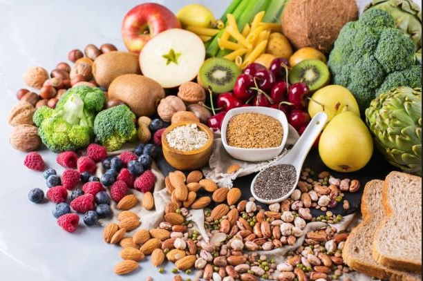
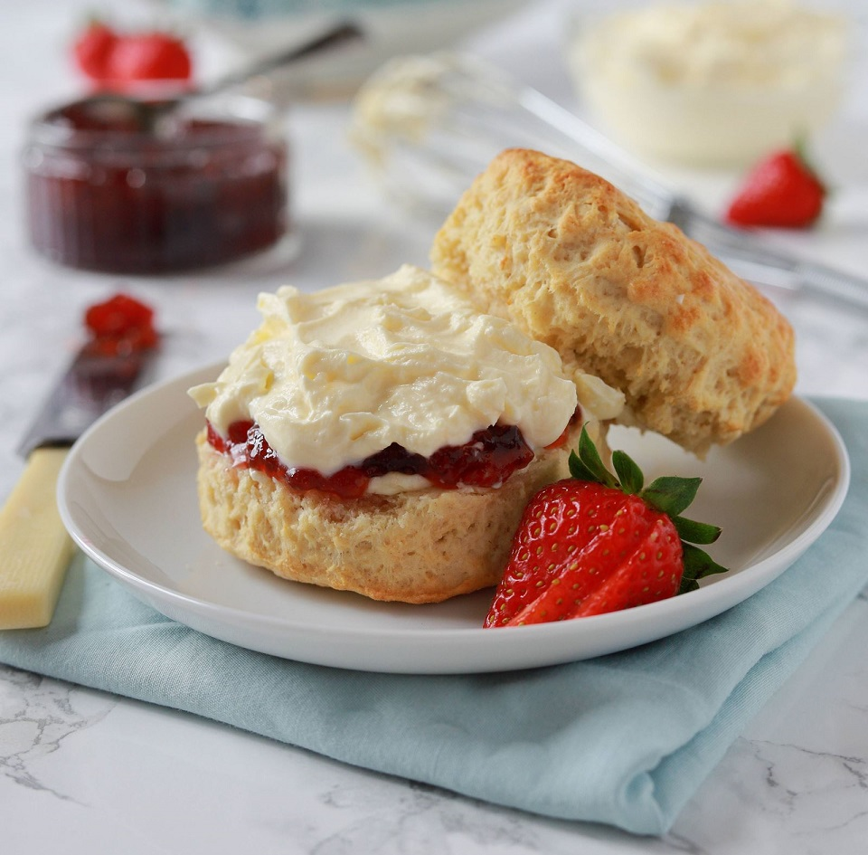

# CLIP and its applications


## Introduction

CLIP (Contrastive Language-Image Pre-Training) is a revolutionary neural network model developed by OpenAI. Unlike traditional machine learning models that are trained to operate within a single modality, CLIP is capable of analyzing and connecting images and text, making it an exciting advancement in the field of natural language processing (NLP) and computer vision (CV). The core idea behind CLIP is to enable the learning of visual representations from text and vice versa. When an image is passed into the CLIP model, it will return the most relevant caption or summary of that image based on probability. The prediction can be achieved without re-training the model for a specific task, similarly to the _zero-shot_ capabilities of GPT-2 and 3, which makes it highly scalable and adaptable to new tasks.   


## How CLIP works

CLIP works by pre-training a large neural network on massive amounts of text and image data using contrastive learning. The goal of contrastive learning is to learn a representation that maximizes the similarity between matched image-text pairs and minimizes the similarity between unrelated image-text pairs.

The CLIP model consists of a text and an image encoder. The function of the text encoder is to encode natural language descriptions, such as captions or textual prompts, into a numerical vector representation that captures the semantic content of the text. This is achieved using a transformer-based architecture (Vaswani et al., 2017). The function of the image encoder is to encode images into a numerical vector representation that captures their visual content. The image encoder can take the form of either a ResNet (He et al., 2016a) or a Vision Transformer (Dosovitskiy et al., 2020). As shown in Fig 1 section (1), the encoded textual and visual information forms a multimodal embedding space where their semantic and visual similarity can be compared and contrasted by the CLIP model. 


[*<center> Fig 1: Summary of CLIP approach. CLIP jointly trains an image encoder and a text encoder to predict the correct pairings of a batch of (image, text) training
examples. At test time the learned text encoder synthesizes a zero-shot linear classifier by embedding the names or descriptions of the target dataset’s classes.</center>*](https://towardsdatascience.com/simple-implementation-of-openai-clip-model-a-tutorial-ace6ff01d9f2)

## Training

The dataset that CLIP was trained on consists of 400 million image-text pairs that spanned a set of 500 thousand queries that featured at least 100 times in the English version of Wikipedia. 

During training, the model receives a batch of N image-text pairs as training examples. Images were simply augmented with a random square crop after they were resized. For every image in the batch, the image encoder computes an image vector with the first image corresponding to the I<sub>1</sub> vector, the second to I<sub>2</sub> and so on until I<sub>N</sub>. Similarly, the text encoder outputs text embeddings T<sub>1</sub> to T<sub>N</sub> for every text in the batch. Finally, the pairwise cosine similarities between every image and text embedding is calculated and output as an N X N matrix. Using a symmetric cross-entropy loss, the text and image encoders are jointly trained by simultaneously maximizing the cosine similarity of accurate text-image pairs and minimizing the cosine similarity of inaccurate text-image pairs. 

The text encoder is a 63M-parameter, 12-layer, 512-wide Transformer with 8 attention heads that had its sequence length limited to 76 for computational efficiency. For the image encoder,5 modified ResNets and 3 Vision Transformers were trained using initial hyper-parameters tuned to the baseline ResNet 50 model when trained for 1 epoch. These hyper-parameters were then refined for the larger models. Interestingly, neither the text encoder nor image encoder were initialized with pre-trained weights for ImageNet that could have served as a heuristic. The moniker CLIP ultimately refers to the ViT-L/14 version as it provided the best performance across tasks.

As a result of the training process, images and the captions that best describe them are put in close proximity within the vector space, while the non-matching images (or captions) are ‘pushed’ further apart, as illustrated in Fig.2.


[*<center> Fig 2: Put image-text pairs close in space by training process</center>*](https://towardsdatascience.com/how-to-train-your-clip-45a451dcd303)


## Inference

During inference, CLIP takes in a set of labels, generates texts based on those labels, and then encodes those texts into embeddings using a text encoder. These text embeddings are then matched with the corresponding image embeddings to predict the most likely text description for the image, as shown in Fig.1 section (2). Figure 3 visualizes the predictions from 2 CLIP zero-shot classifiers.The predicted probability of the top 5 classes is shown along with the text used to represent the class. The correct answer is highlighted as green whereas the wrong answer is highlighted as orange.


[*<center> Fig 3: Visualization of predictions from 2 CLIP zero-shot classifiers.  The predicted probability of the top 5 classes is shown along with the text used to represent the class. The ground truth label is colored green while an incorrect
prediction is colored orange. </center>*](https://cdn.openai.com/papers/Learning_Transferable_Visual_Models_From_Natural_Language_Supervision.pdf) 

Fig.4 shows the numpy-like pseudocode for the core of an implementation of CLIP:


[*<center> Fig 4: Pseudocode for CLIP</center>*](https://cdn.openai.com/papers/Learning_Transferable_Visual_Models_From_Natural_Language_Supervision.pdf)

## Use Case Demo: CLIP Prefix Captioning.

[](https://choosealicense.com/licenses/mit/)

### Description  

In this article, we are fine-tuning ["ClipCap: CLIP Prefix for Image Captioning"](https://github.com/rmokady/CLIP_prefix_caption) that is based on [CLIP](https://github.com/openai/CLIP) to provide captions for our food-based dataset.

If you are unfamiliar with either resource, please visit the links above first. Our code is largely an extension of the former and we take no credit for any of the authors' code.


### Inference Examples


 Images        | Finetuned with Food Dataset           | Original  
| ------------- |:-------------:| -----:|
|    | A healthy diet of fruits, vegetables, nuts, seeds, nuts, seeds, and whole grains. | A table topped with lots of different types of fruits and vegetables. |
|       | Pastries and muffins sitting on a table next to each other on a blue background.      |   a close up of muffins on a napkin on a table |
| | A bowl of pasta with noodles and cheese on a wooden table.     |    A bowl of spaghetti and a fork on a table. |
|  | A bowl of soup with vegetables and noodles on a plate.    |    A bowl of soup, a bowl of vegetables, and a bowl of rice.|
|  | A plate topped with cheesecake and strawberries on a table.    |    A plate with a strawberry and cream sandwich and a cup of coffee.|
|  | A plate of cookies and muffins on a table next to a cup of coffee.    |    A table topped with a plate of cookies and muffins..|

For convenient inference, we have included a [Colab notebook](https://colab.research.google.com/drive/15WNs3DqS03eWdo6mE521yZfhX8xl8lmd?usp=sharing) originally written by the authors and modified by us.

### Prerequisites for Fine-tuning

1. Clone, create environment and install dependencies:  
```
git clone https://github.com/rmokady/CLIP_prefix_caption && cd CLIP_prefix_caption
conda env create -f environment.yml
conda activate clip_prefix_caption
```
2. Download the [pretrained weights](https://drive.google.com/file/d/1IdaBtMSvtyzF0ByVaBHtvM0JYSXRExRX/view?usp=sharing) by Mokady et al. (2021) for the COCO dataset. The path to the weights will be required later on.

### Fine-tuning on your own data

Extract CLIP features using `parse_food.py` (output is `./RN50x4_RN_train.pkl`):
```
python parse_food.py --clip_model_type RN50x4 --data_path <CAPTION_DIR> --token_limit <MAX_TOKEN_LEN> --train_size <%_DATASET>
```
Train with fine-tuning of GPT2 included:
```
python train.py --data ./data/ViT-B_32_train.pkl --out_dir ./food_train/ --weights_dir ./pretrained_model
```

Train only the transformer mapping network (leaving GPT2 untouched):
```
python train.py --only_prefix --data ./RN50x4_RN_train.pkl --out_dir ./model_checkpoints --mapping_type transformer  --num_layers 8 --prefix_length 40 --prefix_length_clip 40 --is_rn --weights_dir ./pretrained_model
```

Inference can be done with CLI:
```
python predict.py --beam --load_pt <CKPT_PATH> --img <IMG_PATH> --temp <TEMPERATURE>
```


### Model Architecture


*<center> Fig 5: Model architecture</center>*

Our best inference results were obtained by only training the ResNet based transformer while keeping CLIP and GPT2 frozen. 

Our final checkpoint was trained on a subset `train_size = 0.3` of the [food dataset](https://www.kaggle.com/datasets/zeynaloy/food-related-pictures-dataset-with-captions) from Kaggle.

An important parameter to note at inference is the `Temperature`. Temperature scales the values of the logits from GPT2 before they enter the softmax and hence changes the probability distribution of the words generated in the captions. -- Varying `Temperature` can lead to significantly different results with lower temperatures typically associated with more deterministic outcomes.


| `Temperature`= 1 | `Temperature`= 0.1|
| ---|:---|
| A healthy diet of fruits, vegetables, seeds, nuts, seeds, and whole grains.| A healthy eating diet with healthy foods and healthy fats. |

To fine-tune the model for a specific task, the last layer of the text encoder can be replaced with a task-specific layer and the entire model trained using a smaller dataset. Alternatively, a secondary model architecture can be built upon CLIP that takes in its output as its input. This approach, known as transfer learning, allows the model to quickly adapt to new tasks and achieve state-of-the-art performance with minimal training data.

CLIP has a wide range of possible use cases in various industries such as healthcare, e-commerce, education, entertainment, and more. Below, we have gathered some of the following use cases and possible enhancements for CLIP to elaborate on:

CLIP can be used for image and text generation where users are able to generate images or text based on a given prompt. This can be useful in entertainment, where users can create personalized content, such as memes or captions. Here, we provide a brief guide to fine-tune an existing caption model (Mokady, Hertz, & Bermano, 2021) built upon CLIP. We will be using the [food dataset](https://www.kaggle.com/datasets/zeynaloy/food-related-pictures-dataset-with-captions) with captions from Kaggle.


*<center> Fig 6: Word cloud for the captions </center>*


## Other Use Cases:

- Remote sensing(satellite) image captioning: CLIP can be used to caption and classify satellite images in areas not limited to meteorology and weather forecasting, fishing, oceanography, agriculture, conservation, forestry, landscape analysis, geology, mapping, regional planning, environmental assessment, intelligence, warfare and education. 

- Image and text search: CLIP can be used for image and text search, where users can search for images or text based on keywords. This can be useful in e-commerce, where users can search for products using natural language, such as "black shirt with rabbit". A fine-tuned model can also be used offline to search through databases where privacy may be a concern.

- Content moderation: CLIP can be used for content moderation, where images and text can be classified as safe or unsafe based on their content. This can be useful in social media, where inappropriate content can be automatically flagged and removed.

- Medical diagnosis: CLIP can be used for medical diagnosis, where images and text can be classified as normal or abnormal based on their content. Furthermore, the model can also be trained to annotate medical images with captions or descriptions. This can help expedite the work of healthcare professionals and radiographers or be used as an educational tool.

- Autonomous vehicles: CLIP can be used in autonomous vehicles, where the system can recognize and classify objects based on their visual appearance and their corresponding text labels. This can be useful in self-driving cars, where the system can identify road signs and other objects on the road.

## Current Limitations

While CLIP has shown impressive results on various tasks, it is not without its limitations. Some limitations include: 

1. Zero-shot CLIP's performance is generally competitive with a simple supervised linear classifier on top of ResNet-50 features but falls well below state-of-the-art performance

2. A significant increase in compute is required for zero-shot CLIP to reach overall state-of-the-art performance

3. CLIP has poor zero-shot performance on several types of fine-grained classification and struggles with abstract and systematic tasks

4. Although CLIP is flexible, it is still limited to choosing from only those concepts in a given zero-shot classifier

5. CLIP's training data has social biases

6. CLIP's current processing time can be slow, especially for large datasets. Enhancing CLIP to perform real-time processing can make it more efficient and scalable for various applications.

## Possible Enhancements

1. Combining CLIP with self-supervision and self-training methods to improve data efficiency

2. Creating a new benchmark for evaluating zero-shot transfer capabilities

3. Improving the computational efficiency of image caption baselines

## Conclusion

CLIP is a groundbreaking model that can create meaningful shared representations for both text and images, contributing greatly towards the field of multi-modal learning. It has numerous use cases across various industries, and ongoing research is focused on improving the model's accuracy and efficiency. While there are still some limitations, the development of CLIP has opened up new avenues for research and application in the field of machine learning. The possibilities are endless and only limited by creativity and innovation.

## References

Radford, Alec, Jong Wook Kim, Chris Hallacy, Aditya Ramesh, Gabriel Goh, Sandhini Agarwal, Girish Sastry et al. "Learning transferable visual models from natural language supervision." In International conference on machine learning, pp. 8748-8763. PMLR, 2021.

Dosovitskiy, A., Beyer, L., Kolesnikov, A., Weissenborn, D., Zhai, X., Unterthiner, T., Dehghani, M., Minderer, M., Heigold, G., Gelly, S., et al. An image is worth 16x16 words: Transformers for image recognition at scale. arXiv:2010.11929, 2020.

He, K., Zhang, X., Ren, S., and Sun, J. Deep residual learning for image recognition. In Proceedings of the IEEE conference on computer vision and pattern recognition, pp. 770–778, 2016a.

Mokday, R., Hertz, A., and Bermano, A. H. ClipCap: CLIP prefix for image captioning. arXiv:2111.09734, 2021.

Vaswani, A., Shazeer, N., Parmar, N., Uszkoreit, J., Jones, L., Gomez, A. N., Kaiser, Ł., and Polosukhin, I. Attention is all you need. In Advances in neural information processing systems, pp. 5998–6008, 2017.


