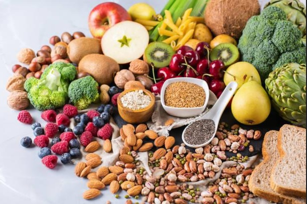
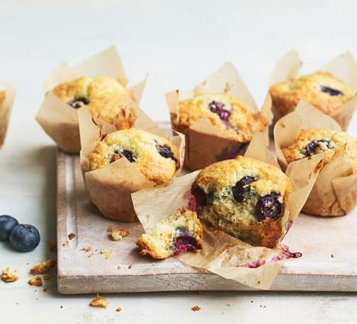
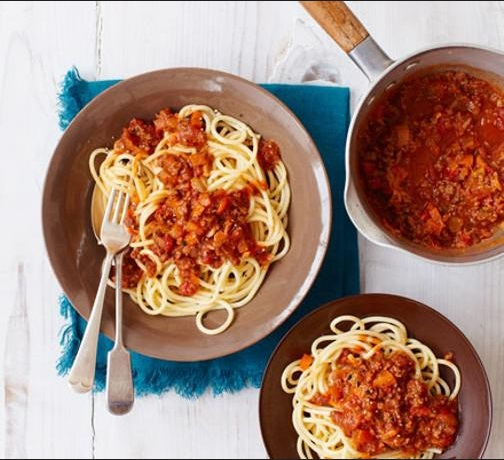
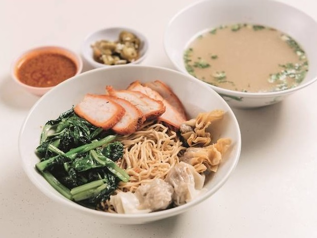
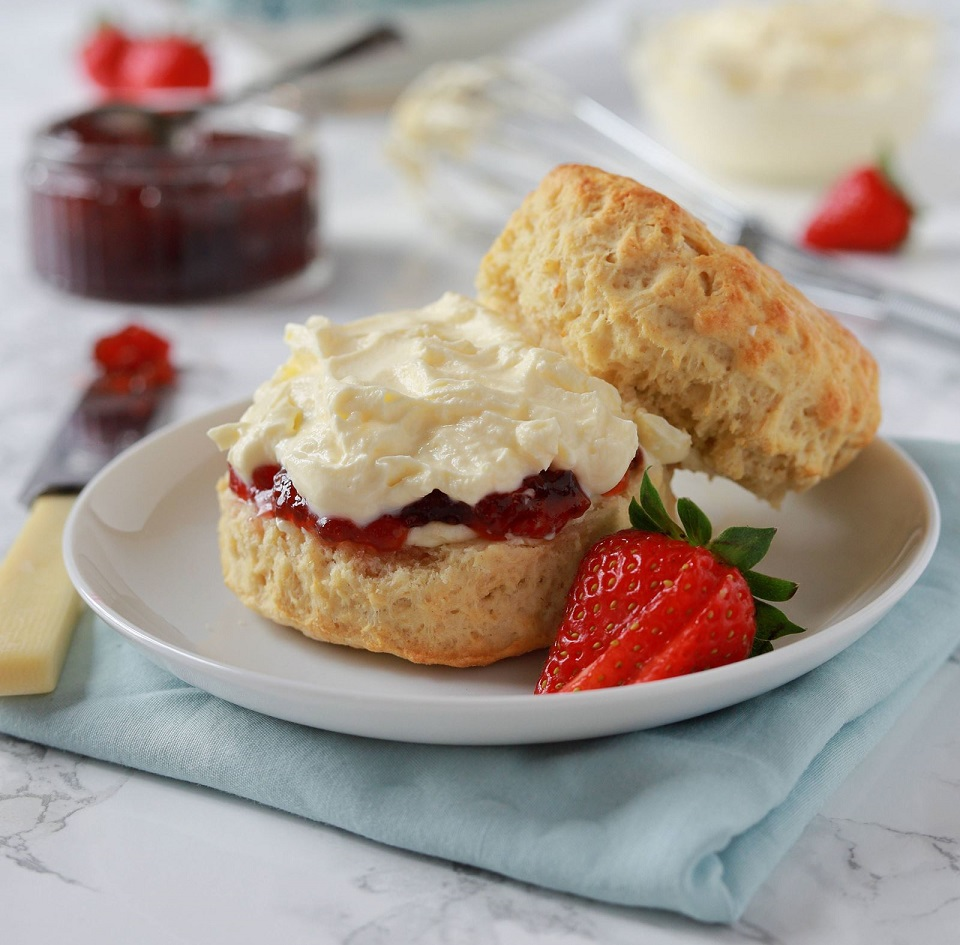
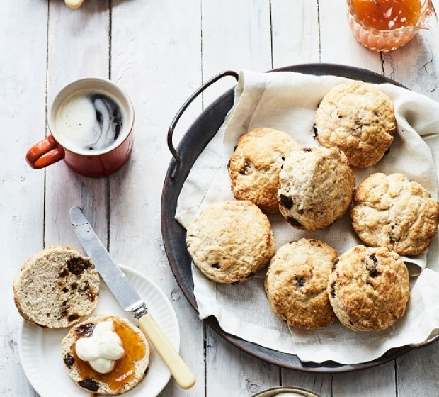
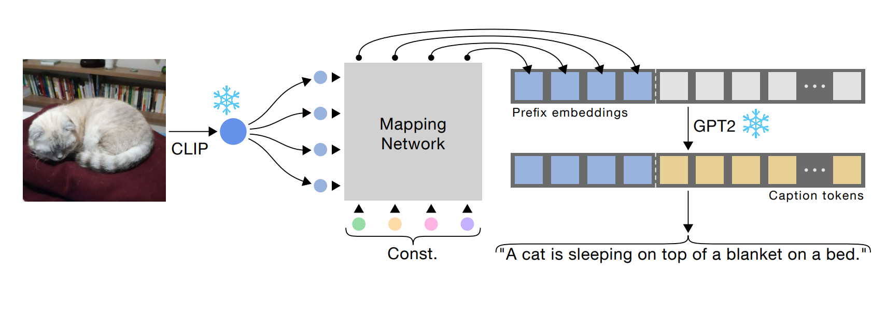

# CLIP Prefix Captioning.

[](https://choosealicense.com/licenses/mit/)

## Description  

In this article, we are fine-tuning ["ClipCap: CLIP Prefix for Image Captioning"](https://github.com/rmokady/CLIP_prefix_caption) that is based on [CLIP](https://github.com/openai/CLIP) to provide captions for our food-based dataset.

If you are unfamiliar with either resource, please visit the links above first. Our code is largely an extension of the former and we take no credit for any of the authors' code.


## Inference Examples


 Images        | Finetuned with Food Dataset           | Original  
| ------------- |:-------------:| -----:|
|    | A healthy diet of fruits, vegetables, nuts, seeds, nuts, seeds, and whole grains. | A table topped with lots of different types of fruits and vegetables. |
|       | Pastries and muffins sitting on a table next to each other on a blue background.      |   a close up of muffins on a napkin on a table |
| | A bowl of pasta with noodles and cheese on a wooden table.     |    A bowl of spaghetti and a fork on a table. |
|  | A bowl of soup with vegetables and noodles on a plate.    |    A bowl of soup, a bowl of vegetables, and a bowl of rice.|
|  | A plate topped with cheesecake and strawberries on a table.    |    A plate with a strawberry and cream sandwich and a cup of coffee.|
|  | A plate of cookies and muffins on a table next to a cup of coffee.    |    A table topped with a plate of cookies and muffins..|

## Prerequisites for Fine-tuning

1. Clone, create environment and install dependencies:  
```
git clone https://github.com/rmokady/CLIP_prefix_caption && cd CLIP_prefix_caption
conda env create -f environment.yml
conda activate clip_prefix_caption
```
2. Download the [pretrained weights](https://drive.google.com/file/d/1IdaBtMSvtyzF0ByVaBHtvM0JYSXRExRX/view?usp=sharing) by Mokady et al. (2021) for the COCO dataset. The path to the weights will be required later on.

## Fine-tuning on your own data

Extract CLIP features using `parse_food.py` (output is `./RN50x4_RN_train.pkl`):
```
python parse_food.py --clip_model_type RN50x4 --data_path <captions dir> --token_limit <max token length> --test_size <% of dataset>
```
Train with fine-tuning of GPT2 included:
```
python train.py --data ./data/ViT-B_32_train.pkl --out_dir ./food_train/ --weights_dir ./pretrained_model
```

Train only the transformer mapping network (leaving GPT2 untouched):
```
python train.py --only_prefix --data ./RN50x4_RN_train.pkl --out_dir ./model_checkpoints --mapping_type transformer  --num_layers 8 --prefix_length 40 --prefix_length_clip 40 --is_rn --weights_dir ./pretrained_model
```


## Model Architecture



Our best inference results were obtained by only training the ResNet based transformer while keeping CLIP and GPT2 frozen. 

Our final checkpoint was trained on a subset `test_size = 0.3` of the [food dataset](https://www.kaggle.com/datasets/zeynaloy/food-related-pictures-dataset-with-captions) from Kaggle.

An important parameter to note at inference is the `Temperature`. Temperature scales the values of the logits from GPT2 before they enter the softmax and hence changes the probability distribution of the words generated in the captions. -- Varying `Temperature` can lead to significantly different results with lower temperatures typically leading to more deterministic outcomes.


| `Temperature`= 1 | `Temperature`= 0.1|
| ---|:---|
| A healthy diet of fruits, vegetables, nuts, seeds, nuts, seeds, and whole grains.| A healthy eating diet with healthy foods and healthy fats. |

